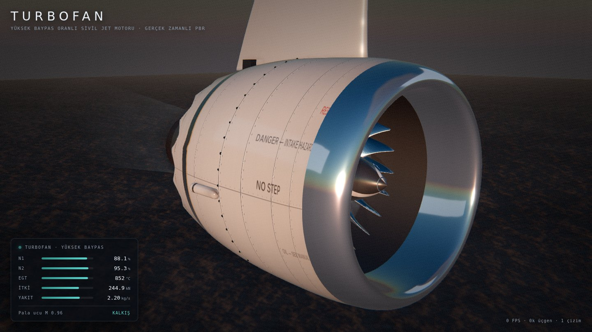
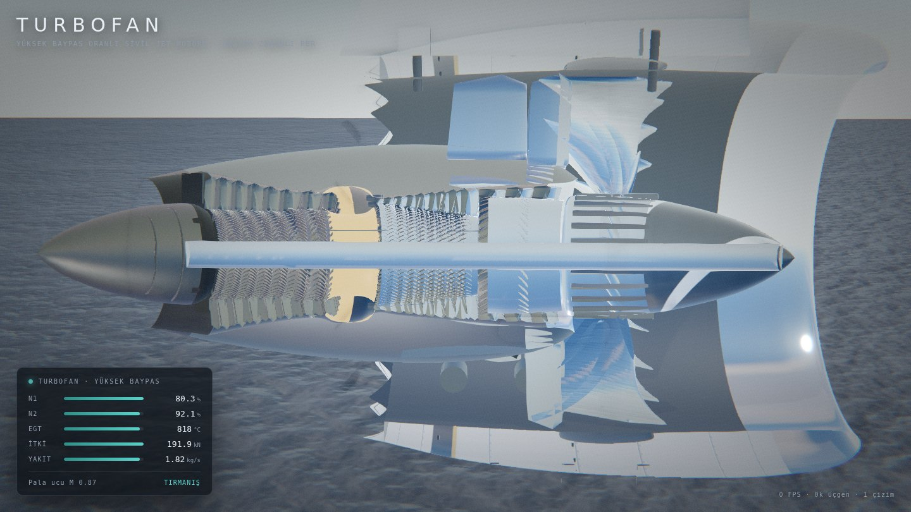
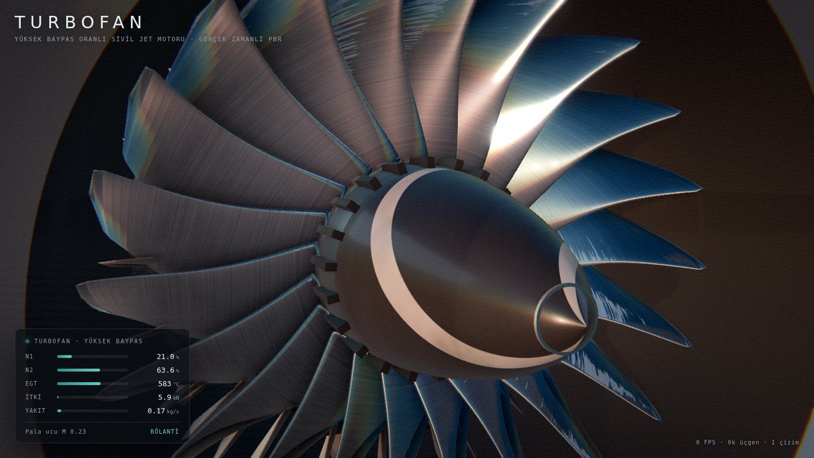
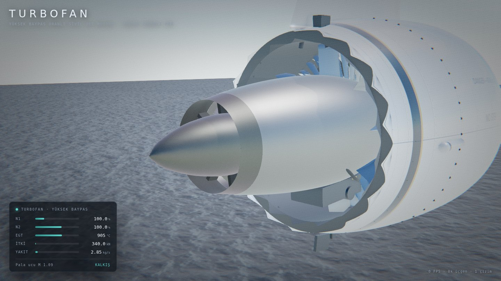
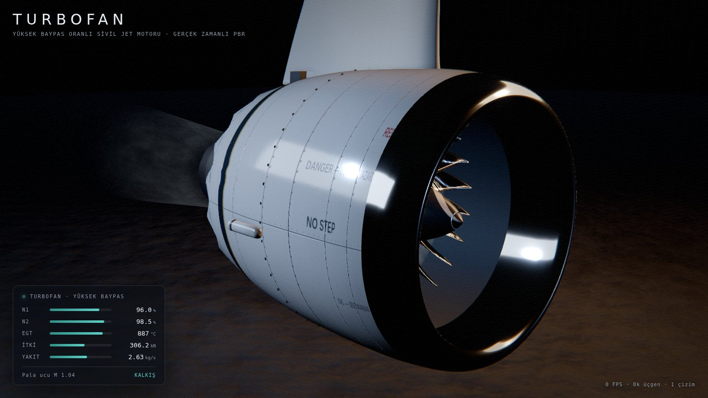

# Hiper Gerçekçi Turbofan

Yüksek baypas oranlı sivil bir jet motorunun **tarayıcıda gerçek zamanlı,
fiziksel tabanlı (PBR)** görselleştirmesi. Hazır bir 3B model dosyası
kullanılmaz; bütün geometri, dokular ve aydınlatma kod içinde prosedürel
olarak üretilir.



## Çalıştırma

### Hiçbir şey kurmadan (tek dosya)

Depodaki **`turbofan.html`** kendi kendine yeten tek bir dosyadır: three.js,
stiller ve bütün kod içine gömülüdür. İndirip **çift tıklamak yeterli** —
Node.js, sunucu, internet ya da editör gerekmez. Modern bir tarayıcı
(Chrome, Edge, Firefox, Safari) ve WebGL destekli bir ekran kartı yeterlidir.

Dosya paylaşırken not: bazı mesajlaşma uygulamaları `.html` uzantısını
engeller. O durumda dosyayı zip'leyip gönderin, karşı taraf çıkarıp açsın.

Bu dosyayı kaynaktan yeniden üretmek için:

```bash
npm install
npm run build:single    # → turbofan.html
```

### Geliştirme kipi

```bash
npm install
npm run dev        # http://localhost:5173
```

Üretim derlemesi ve önizleme:

```bash
npm run build
npm run preview    # http://localhost:4173
```

Kontroller: **sürükle** döndürür, **tekerlek** yakınlaştırır, **sağ tık
sürükle** kaydırır. Sağ üstteki panelden gaz kolu, ortam, kamera açısı,
kesit görünümü ve görüntü işleme ayarları değiştirilir.

## Ne modellendi

| Bölüm | İçerik |
| --- | --- |
| Hava girişi | Parlatılmış alüminyum dudak, boğaz daralması, akustik astarlı kanal |
| Fan | 22 adet geniş kordlu, pala uçları öne kıvrımlı titanyum kanat; sarmal işaretli burun konisi |
| Baypas | Fan çıkış yönlendirici kanatları (44), 8 yapısal çerçeve kolu, çevrikli (chevron) lüle |
| Çekirdek | 3 kademe booster, 9 kademe HP kompresör, halka yanma odası + 20 enjektör, 2 kademe HP türbin, 5 kademe LP türbin |
| Egzoz | Türbin arka çerçevesi, is kaplı kanal, birincil lüle, tavlanmış inconel egzoz konisi |
| Dış donanım | Pilon ve motor bağlantı mahmuzları, aksesuar dişli kutusu, yakıt/hidrolik hatları, kaporta kilitleri, drenaj mastı |

İki ayrı mil grubu bağımsız döner: **LP** (fan + booster + LP türbin) ve
**HP** (HP kompresör + HP türbin).

## Gerçekçiliği taşıyan teknikler

**Geometri.** Bütün kanatlar NACA 4-haneli kalınlık dağılımı ve dairesel
kamber çizgisinden kesit kesit üretilip kök→uç boyunca burulma, ok açısı,
yana yatma ve kord değişimiyle loft edilir (`src/engine/airfoil.js`). Fan
kanadı bu sayede gerçek bir geniş kordlu tasarım gibi kökte ~62°, uçta ~16°
burulmaya ve pala ucunda öne kıvrıma sahiptir. Gövdeler Catmull-Rom ile
yumuşatılmış profillerin döndürülmesiyle (lathe) elde edilir.

**Dokular.** Albedo / pürüzlülük / normal haritaları çalışma anında canvas
üzerinde fbm gürültüsüyle üretilir (`src/materials/textures.js`): panel
derzleri, perçin sıraları, fırça izleri, arkaya doğru artan kurum, hücum
kenarı aşınması, jenerik havacılık ikaz yazıları. Yazılar lathe UV'sine
göre gövdenin sağ ve sol yüzüne ayrı ayrı, doğru yönde basılır.

**Malzemeler.** Boyalı kaporta için clearcoat (vernik) katmanı, fan kanadı
için anizotropik titanyum, egzoz konisi için ince film girişimli (tavlanmış)
inconel, yanma odası için EGT ile renk değiştiren ışıyan yüzey.

**Aydınlatma.** Preetham fiziksel gökyüzü modeli her karede PMREM ile ortam
haritasına dönüştürülür; metaller gerçekten gökyüzünü ve zemini yansıtır.
Buna yönlü güneş (4096² gölge haritası), dikdörtgen alan ışıkları ve dört
hazır ortam eşlik eder: altın saat, öğle güneşi, kapalı hava, gece apronu.

**Görüntü işleme.** GTAO → ton eşleme (AgX) → bloom → kamera derecelendirmesi
→ SMAA. Derecelendirme aşaması sıcak egzozun arkasındaki görüntüyü ekran
uzayında kıvıran ısı kırılmasını, lens renk sapmasını, vinyeti ve sensör
grenini uygular.

**Çalışma modeli.** Gaz kolu bir hedef N1 belirler; N1 birinci dereceden
gecikmeyle bu hedefe yaklaşır (gaz alırken yavaş, keserken hızlı), N2 N1'i
daha çabuk takip eder, EGT ise N2'nin gerisinden gelir. Telemetri paneli
N1/N2/EGT/itki/yakıt akışı ve pala ucu Mach sayısını canlı gösterir. Devir
yükseldikçe kanatların üzerine hareket bulanıklığı diski bindirilir.

## Görünümler

Kesit modu, kırpma düzlemiyle motoru boydan boya açar:



| | |
| --- | --- |
|  |  |
|  | |

## Kaynaktan kare almak

`scripts/shoot.mjs`, headless Chromium ile hazır kamera açılarından render
alır (bu depodaki görseller de böyle üretildi):

```bash
npm run build && npm run preview &
node scripts/shoot.mjs renders                       # PNG
SHOT_FORMAT=jpeg SHOT_W=1440 SHOT_H=810 node scripts/shoot.mjs renders
```

Ortam değişkenleri: `SHOT_W`, `SHOT_H`, `SHOT_FORMAT`, `SHOT_QUALITY`,
`SHOT_FILTER` (örn. `01,06`), `SHOT_URL`, `PW_CHROMIUM`.

## Dosya düzeni

```
turbofan.html             kurulum gerektirmeyen tek dosyalık sürüm (derleme çıktısı)
src/
  main.js                 uygulama girişi, çizim döngüsü, kesit ve kamera geçişleri
  core/environment.js     gökyüzü, güneş, PMREM ortam haritası, zemin, hazır ortamlar
  core/postfx.js          post-process zinciri ve kamera derecelendirme shader'ı
  materials/textures.js   prosedürel doku üretimi (fbm, panel derzi, normal harita)
  materials/library.js    PBR malzeme kütüphanesi ve kesit kırpması
  engine/geom.js          profil/lathe/dizi yardımcıları
  engine/airfoil.js       NACA kesitleri ve kanat loft üreteci
  engine/nacelle.js       hava girişi, kaporta, baypas kanalı, chevron lüle
  engine/fan.js           burun konisi, fan diski, kanatlar, hareket bulanıklığı
  engine/core.js          booster, HP kompresör, yanma odası, türbinler, egzoz
  engine/pylon.js         pilon, bağlantı mahmuzları, kanat kökü
  engine/exhaust.js       egzoz akışı shader'ı
  engine/index.js         montaj, mil dinamiği ve telemetri
  ui/gui.js, ui/hud.js    kontrol paneli ve telemetri göstergesi
scripts/shoot.mjs         headless render aracı
scripts/bundle-single.mjs tek dosyalık HTML paketleyici
vite.config.js            normal ve tek dosya derleme kipleri
```

## Notlar

- Performans için: gölge çözünürlüğü, GTAO ve SMAA en pahalı kalemlerdir;
  panelden kapatılabilir. Yazılım rasterleştirici (SwiftShader) üzerinde
  yavaştır, gerçek GPU'da akıcı çalışır.
- Tek dosya kipinde paket ES modülü yerine IIFE olarak derlenir; tarayıcılar
  `file://` üzerinden modül yüklemeyi engellediği için klasik script etiketi
  şarttır.
- Motor jenerik bir yüksek baypas turbofandır; herhangi bir üreticinin
  markası, logosu veya tescilli tasarımı kullanılmamıştır. Ölçüler
  (2.77 m fan çapı, ~340 kN itki, 9.2 baypas oranı) sınıfın tipik
  değerlerine yakın seçilmiştir.
