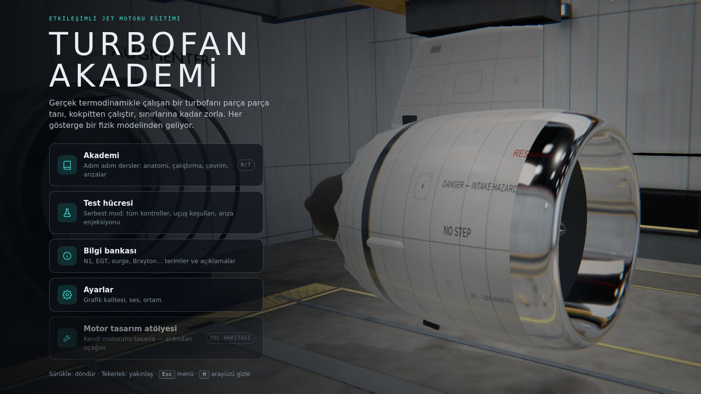
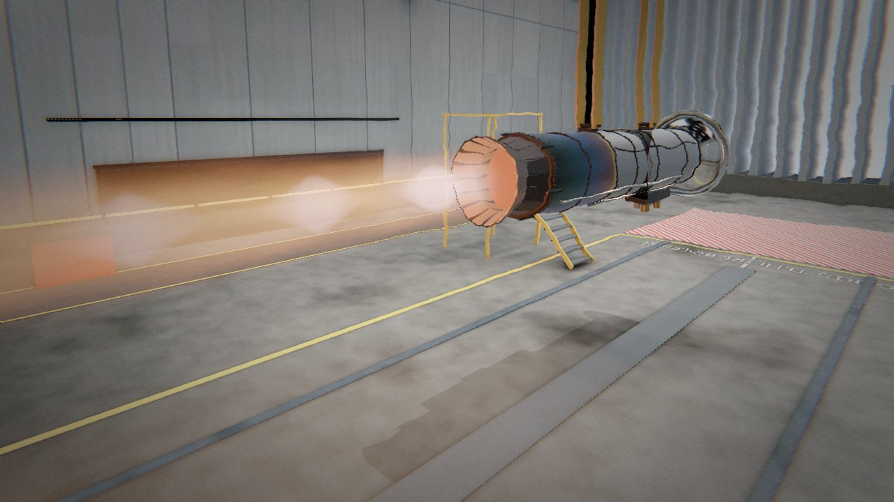
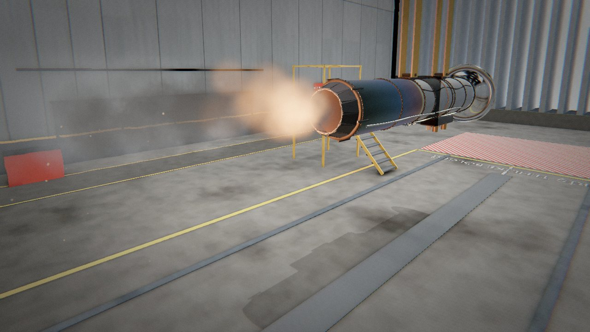
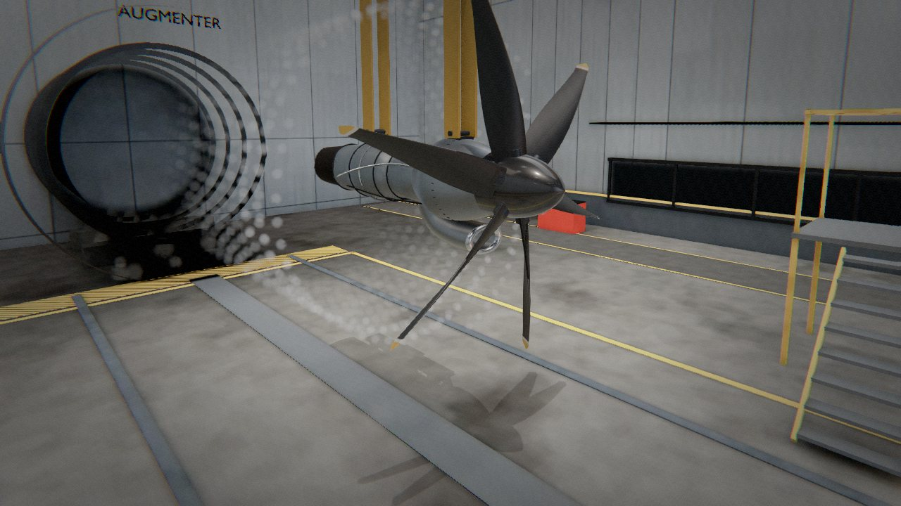
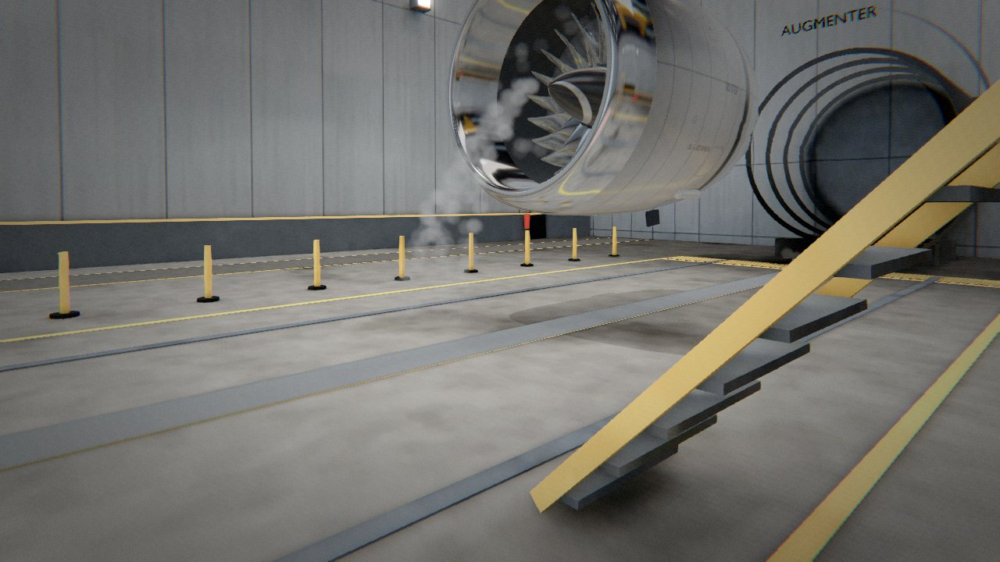
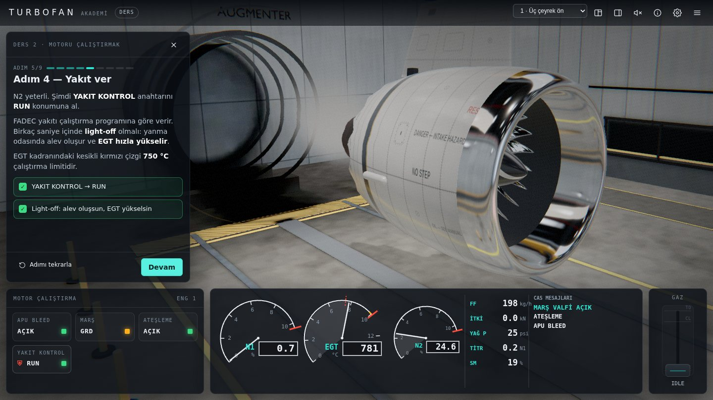

# Turbofan Akademi

Gerçek termodinamikle çalışan bir turbofan jet motorunu parça parça tanıdığın,
kokpitten çalıştırdığın ve sınırlarına kadar zorladığın **etkileşimli eğitim
oyunu**. Ekrandaki her gösterge — N1, N2, EGT, yakıt akışı, itki, surge payı —
bir fizik modelinden hesaplanır; hiçbiri önceden kaydedilmiş bir animasyon
değildir.



## Hemen oyna (kurulum yok)

Depodaki **`turbofan.html`** kendi kendine yeten tek bir dosyadır. İndirip çift
tıklamak yeterli: Node.js, sunucu, internet gerekmez. Modern bir tarayıcı ve
WebGL destekli bir ekran kartı yeterli. Dosyayı mesajlaşma uygulamasıyla
gönderirken uygulama `.html` uzantısını engellerse zip'leyip gönderin.

## Neler var

**Akademi — 7 ders**

| # | Ders | Konu |
| --- | --- | --- |
| 1 | Turbofan'ın anatomisi | Havanın yolu; kesit görünümünde parçaları 3B'de bulma sınavı |
| 2 | Motoru çalıştırmak | APU bleed → marş → ateşleme → %20 N2'de yakıt → light-off → rölanti |
| 3 | Brayton çevrimi | Canlı T–s diyagramı, basınç oranı, itkinin fan/çekirdek paylaşımı |
| 4 | Gaz kolu ve FADEC | Spool gecikmesi, 5 saniye kuralı, hassas N1 kontrolü |
| 5 | Kompresör stall'u | FADEC kapalıyken elle yakıt vererek surge'ü bizzat yaşamak |
| 6 | İrtifa ve sıcak günler | 11 km'de itki kaybı, ram direnci, ISA+30'da EGT sınırlaması |
| 7 | Kuş çarpması | Belirtileri tanıma ve motoru güvenle kapatma |

Dersler adım adım ilerler: okunacak açıklama, simülasyona karşı denetlenen
hedefler (ör. "N1'i %78–82'de 5 saniye tut"), quiz'ler ve 3B parça seçme
görevleri. Yanlış prosedür (ör. yakıtı çok erken vermek) adımı başarısız sayar
ve tekrarlatır. Her ders yıldızla puanlanır ve ilerleme tarayıcıda saklanır.

**Test hücresi ortamı** — Blender'da modellenip Cycles ile ışığı pişirilmiş
kapalı motor test hücresi: ses yutucu panelli duvarlar, hava girişi susturucusu,
arkada egzoz augmenter'ı, itki ölçüm çerçevesi ve yük hücresi, kontrol odası
camı, bakım platformu, zemin işaretleri. Motorun yansımaları da bu hücreden
alınır. Ayarlardan açık hava (pist) ortamına geçilebilir.

**Panel detayı** — fan kaportası, çekirdek kaportası ve pilon: perçin ve vida
sıraları, kamlok bağlantılar, yağ servis ve basınç tahliye kapakları, alt kilit
yuvaları, havalandırma panjurları, boroskop tapaları. Blender'da yüksek
poligonlu olarak modellenip normal + AO haritalarına pişirilir.

**Dört motor tipi** — test hücresinde motor seçilebilir; hepsi aynı
termodinamik modelle, kendi tasarım noktasından boyutlandırılır:

| Motor | Sınıf | Öne çıkan |
| --- | --- | --- |
| TF-330 yolcu turbofanı | ~320 kN, BPR 9 | Dev fan, ayrık akış, dersler bu motorla |
| AF-125 askeri turbofan | 81 kN kuru / 129 kN art yakıcılı | Karışık akış, art yakıcı, açılıp kapanan yakınsak-ıraksak lüle |
| TJ-60 turbojet | 45 / 64 kN | Soğuk savaş dönemi, baypassız, iki milli, is bırakan egzoz |
| TP-25 turboprop | 2,85 MW mil gücü | Serbest güç türbini, dişli kutusu, sabit devirli pervane valisi |

Gaz kolu art yakıcılı motorlarda MIL kademesinin ötesine uzanır (IDLE → MIL →
MAX, **B** tuşu); EICAS motor tipine göre değişir (FTIT, TRQ/ITT/NG, NP, lüle
açıklığı, art yakıcı kademesi).

**Efektler** — art yakıcıda ışın yürütmeli (raymarch) hacimsel alev ve jet Mach
sayısından hesaplanan şok elmasları; ıslak çalıştırmada yakıt buharı,
light-off'ta is ve kıvılcım, torching ve surge ateş topları, kapatmada buhar;
eski turbojetin dumanı; yerden girişe kıvrılan yoğuşma girdabı, giriş dudağında
yoğuşma, zeminden kalkan toz, pervane uç girdaplarının sarmal izi, sıcak
egzozun ısı kırılması ve zemine vuran art yakıcı ışığı.

| | |
| --- | --- |
|  |  |
|  |  |

**Serbest mod** — test hücresinde bütün anahtarlar, FADEC'i manuele alma, irtifa /
Mach / sıcaklık, simülasyon hızı (¼×–4×), arıza enjeksiyonu (kuş çarpması,
kompresör/türbin aşınması, marş ve ateşleyici arızası).

**Kokpit** — Boeing tarzı EICAS (N1/EGT/N2 kadranları, FADEC'in magenta hedef
imleci, CAS uyarı mesajları), overhead tarzı çalıştırma paneli, kademeli gaz kolu.

**Motorun içi paneli** — sıcaklığa göre renklenen istasyon şeması (üzerine
gelince 3B'de parça yanar), canlı T–s diyagramı, istasyon tablosu, OPR, BPR,
TSFC, surge payı.

**Ses** — tamamen sentezlenmiş: fan kanat geçiş tonu, süpersonik fan ucunun
"buzz-saw" sesi, çekirdek ıslığı, jet gürlemesi, marş türbini, ateşleyici
tıkırtısı, surge patlaması. Kamera öndeyse fan, arkadaysa jet baskın duyulur.



## Fizik modeli

`src/sim/` görselden tamamen bağımsız, saf TypeScript bir sıfır boyutlu,
iki milli turbofan modelidir:

- **ISA atmosfer** ve ram etkisi; SAE istasyon numaralandırması
  (0, 2, 13, 19, 21, 25, 3, 4, 45, 5, 9)
- **Tasarım noktası** çevrim analizi donanımı boyutlandırır: lüle alanları, HP
  türbin akış kapasitesi, türbin basınç oranları
- **Tasarım dışı** hesap iki eşleşme problemi çözer: HP kompresörün hız hattı
  üzerindeki konumu HP türbin statorunun akış kapasitesine, LP türbin çıkış
  basıncı çekirdek lülesinin akışına göre bulunur. Yakıt ani artınca T4
  yükselir, çalışma noktası fiziksel olarak surge hattına kayar.
- **Mil dinamiği**: türbin–kompresör tork farkı, hava türbinli marş motoru,
  aksesuar yükü, sürtünme
- **FADEC**: N1 izleme, N2 rölanti, N2 azami ve EGT sınırı döngüleri (hız
  biçimli PI, min/max seçimli), surge korumalı ivmelenme ve sönme korumalı
  yavaşlama sınırları, surge'de otomatik yeniden ateşleme
- **Olaylar**: light-off, marş ayrılması, sıcak/takılı/ıslak çalıştırma,
  torching, surge, flameout, aşırı devir, EGT kırmızı çizgi, kalıcı türbin
  hasarı, kuş çarpması

Doğrulanan değerler (jenerik 2.77 m fanlı, GEnx sınıfı bir motor):

| Büyüklük | Model | Bu sınıf için tipik |
| --- | --- | --- |
| Kalkış itkisi (SLS, ISA) | 319 kN | 280–340 kN |
| TSFC (kalkış) | 8.5 g/(kN·s) | 8–9 |
| Toplam basınç oranı | 46 | 40–50 |
| Rölanti | N1 %22, N2 %62, ~7 kN | N1 ~%20, N2 ~%60–65 |
| Çalıştırma süresi / EGT tepe | ~40 s / ~630 °C | 30–60 s / limit 725–750 °C |
| Rölantiden %95 itkiye | ~5 s | ≤ 5 s (FAR/CS 33.73) |
| 10.7 km, M0.8 azami itki | SLS'nin %16'sı | %15–20 |

## Geliştirme

```bash
npm install
npm run dev          # http://localhost:5173
npm test             # simülasyon birim testleri (vitest)
npm run typecheck    # TypeScript denetimi
npm run build:single # → turbofan.html (tek dosya)
```

Otomatik oynanış testi bütün dersleri gerçek arayüz etkileşimleriyle
(anahtarlara tıklama, klavyeyle gaz kolu, quiz, 3B parça seçme) oynar:

```bash
npm run build && npx vite preview --port 4173 &
node scripts/playtest.mjs ekran-goruntuleri/
```

### Blender varlık hattı

Blender varlıkları elle düzenlenmiş `.blend` dosyası olmadan, tamamen kodla
üretilir; her değişiklik incelenebilir ve yeniden üretilebilir. Blender 4.5,
Python paketi olarak kurulabilir (`pip install bpy==4.5.*`, Python 3.11):

```bash
# Test hücresi: modelleme + Cycles ışık pişirme → glb (4 çekirdekte ~1 saat)
python blender/testcell.py --bake --out src/assets/testcell.glb
python blender/testcell.py --bake --size 1024 --samples 48 --out /tmp/taslak.glb  # hızlı taslak

# Panel detayları (fan kaportası, çekirdek kaportası, pilon): yüksek poligon → normal + ORM
python blender/panel_details.py --out src/assets
python blender/panel_details.py --part core --scale 0.5 --out /tmp   # hızlı taslak
```

Panel yerleşimleri (derzler, kapaklar, kilitler, tapalar) `src/materials/panelLayouts.json`
dosyasındadır; Blender modeli ve oyundaki albedo derzleri aynı dosyadan beslenir.

### Dosya düzeni

```
src/
  sim/        termodinamik model, FADEC, olaylar (+ testler)
  engine/     prosedürel 3B motor; visual.ts simülasyonu görselleştirir
  app/        uygulama çekirdeği, kamera, 3B parça seçici
  ui/         EICAS, kokpit, motor içi paneli, ders paneli, menüler
  game/       ders motoru, ders içerikleri, parça bilgileri, bilgi bankası
  audio/      prosedürel motor sesi (Web Audio)
  effects/    art yakıcı alevi, parçacık sistemi, motor efektleri
  core/       gökyüzü/ışık ortamı, görüntü işleme zinciri
  materials/  prosedürel dokular, PBR malzemeler, kaporta yerleşimi
  assets/     Blender çıktıları (test hücresi glb, panel detay dokuları)
blender/      Blender betikleri (test hücresi, panel detayları)
scripts/      tek dosya paketleyici, otomatik oynanış testi
```

İleriye dönük plan (motor tasarım atölyesi, uçak tasarımı, Blender varlık
hattı) için bkz. **[ROADMAP.md](ROADMAP.md)**.

## Daha fazla okuma

- FAA, *Aviation Maintenance Technician Handbook — Powerplant* (FAA-H-8083-32),
  kamu malı
- NASA Glenn Research Center, *Beginner's Guide to Propulsion*
- H. Saravanamuttoo ve ark., *Gas Turbine Theory*
- P. Walsh, P. Fletcher, *Gas Turbine Performance*
- J. Mattingly, *Elements of Propulsion: Gas Turbines and Rockets*

## Not

Motor jeneriktir; hiçbir üreticinin markası, logosu ya da tescilli tasarımı
kullanılmamıştır. Prosedürler eğitim amaçlı basitleştirilmiştir ve gerçek uçak
kontrol listelerinin yerini tutmaz.
