# Turbofan Akademi

Gerçek termodinamikle çalışan bir turbofan jet motorunu parça parça tanıdığın,
kokpitten çalıştırdığın ve sınırlarına kadar zorladığın **etkileşimli eğitim
oyunu**. Ekrandaki her gösterge — N1, N2, EGT, yakıt akışı, itki, surge payı —
bir fizik modelinden hesaplanır; hiçbiri önceden kaydedilmiş bir animasyon
değildir.


## Hemen oyna (kurulum yok)

Depodaki **`turbofan.html`** kendi kendine yeten tek bir dosyadır. İndirip çift
tıklamak yeterli: Node.js, sunucu, internet gerekmez. Modern bir tarayıcı ve
WebGL destekli bir ekran kartı yeterli. Dosyayı mesajlaşma uygulamasıyla
gönderirken uygulama `.html` uzantısını engellerse zip'leyip gönderin.

## Neler var

**Akademi — 7 ders**

| # | Ders | Konu |
| --- | --- | --- |
| 1 | Turbofan'ın anatomisi | Havanın yolu; kesit görünümünde parçaları 3B'de bulma sınavı |
| 2 | Motoru çalıştırmak | APU bleed → marş → ateşleme → %20 N2'de yakıt → light-off → rölanti |
| 3 | Brayton çevrimi | Canlı T–s diyagramı, basınç oranı, itkinin fan/çekirdek paylaşımı |
| 4 | Gaz kolu ve FADEC | Spool gecikmesi, 5 saniye kuralı, hassas N1 kontrolü |
| 5 | Kompresör stall'u | FADEC kapalıyken elle yakıt vererek surge'ü bizzat yaşamak |
| 6 | İrtifa ve sıcak günler | 11 km'de itki kaybı, ram direnci, ISA+30'da EGT sınırlaması |
| 7 | Kuş çarpması | Belirtileri tanıma ve motoru güvenle kapatma |

Dersler adım adım ilerler: okunacak açıklama, simülasyona karşı denetlenen
hedefler (ör. "N1'i %78–82'de 5 saniye tut"), quiz'ler ve 3B parça seçme
görevleri. Yanlış prosedür (ör. yakıtı çok erken vermek) adımı başarısız sayar
ve tekrarlatır. Her ders yıldızla puanlanır ve ilerleme tarayıcıda saklanır.

**Havaalanı ortamı** — Blender'da koddan modellenmiş bir hava üssü
(`blender/airfield.py`): 5 m'lik beton plakalı apron, motor çalıştırma alanı,
jet egzozu saptırma duvarı, kafes kemer kirişli ve ofis katlı iki hangar,
kontrol kulesi, operasyon binası, itfaiye, yakıt tankları, dönen radar,
rüzgâr tulumu, kafes ışık direkleri, taksi yolu tabelaları ve pist. Çevresinde
çalışma anında üretilen 9 km'lik arazi (tarlalar, tepeler, uzak dağlar, köyler),
Poly Haven ağaçlarından pişirilmiş impostor ağaçlar ve çayır öbekleri; tel
çit, elektrik hattı, beton bariyerler, jeneratör, kompresör, sandık ve varil
gibi Poly Haven (CC0) donanımı. Gökyüzü "pure sky" HDRI'dır (öğle, kapalı,
gün batımı); güneş ve sis ondan hesaplanır. Gece apron projektörlerle
aydınlanır. Kaportasız motorlar tekerlekli yer taşıma standına oturur,
pilonlu turbofan çelik bir test sehpasına asılır. Hangar B önünde işaretsiz bir
RQ-4 Global Hawk park etmiştir (NASA 3D Resources). Yüzeyler ambientCG'nin
gerçek malzeme taramalarını kullanır; üstüne dünya konumundan hesaplanan
yıpranma katmanı gelir (taban kiri, yağmur izleri, pas, aşınmış boya; apronda
derz dolgusu, çatlaklar, yağ lekeleri, tekerlek izleri). Cycles'ta pişirilmiş
ortam kapanması binaların içini ve dibini karartır, gölgeler ±120 m'yi kapsar.
Hangar kapıları, trapez sac kaplama ve prekast cepheler Blender'da yüksek
poligondan pişirilmiş dokular kullanır; pencerelerin arkasında "iç mekân
eşleme" ile derinliği olan odalar (lamba, masa, jaluzi) görünür, gece bazı
odaların ışığı yanar. Yazılar Türkçe: cepheye montajlı "HANGAR 1/2",
"İTFAİYE", "HAREKÂT MERKEZİ" harfleri, kapı kanatlarında şablon numaralar,
zeminde "MOTOR ÇALIŞTIRMA", uyarı levhaları ve ışıklı taksi yolu tabelaları.

| | |
| --- | --- |
| 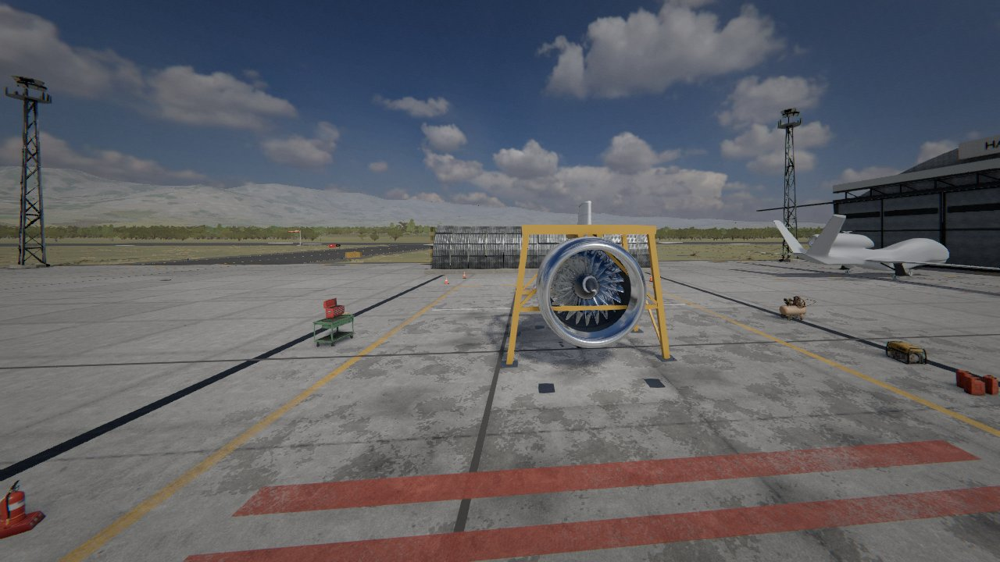 | 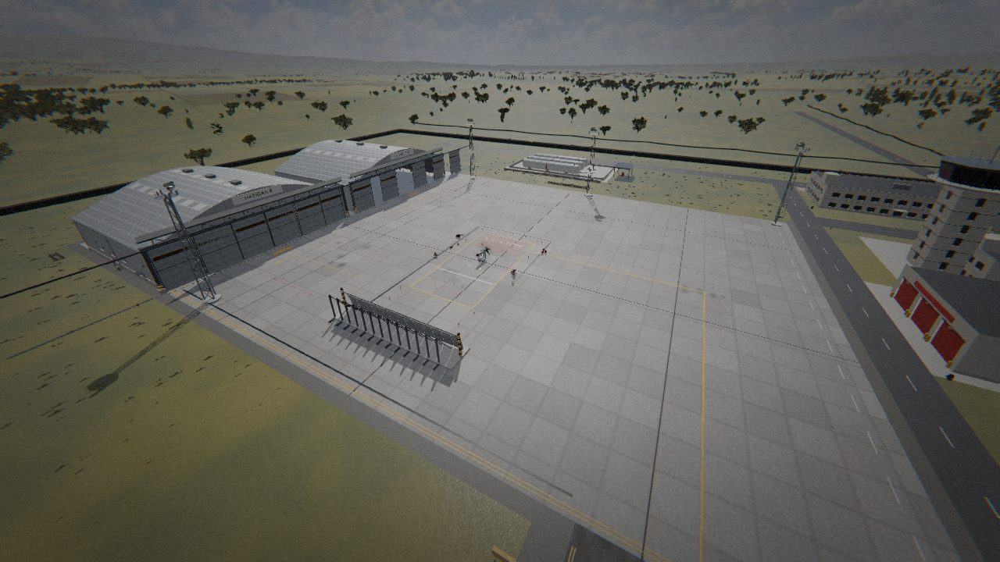 |
| 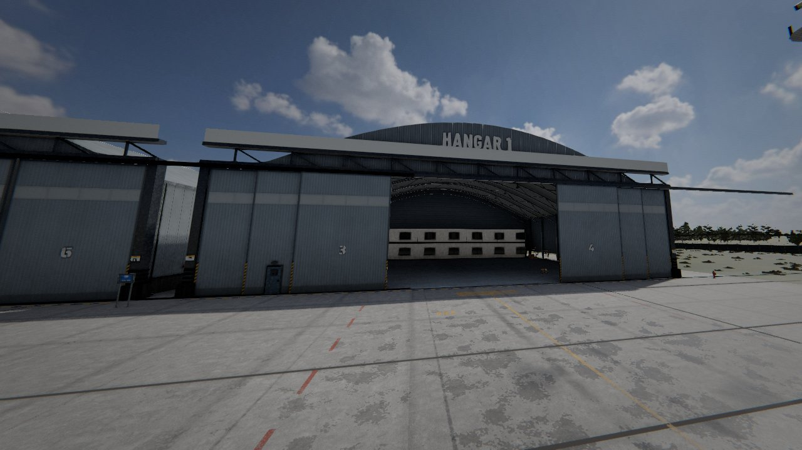 | 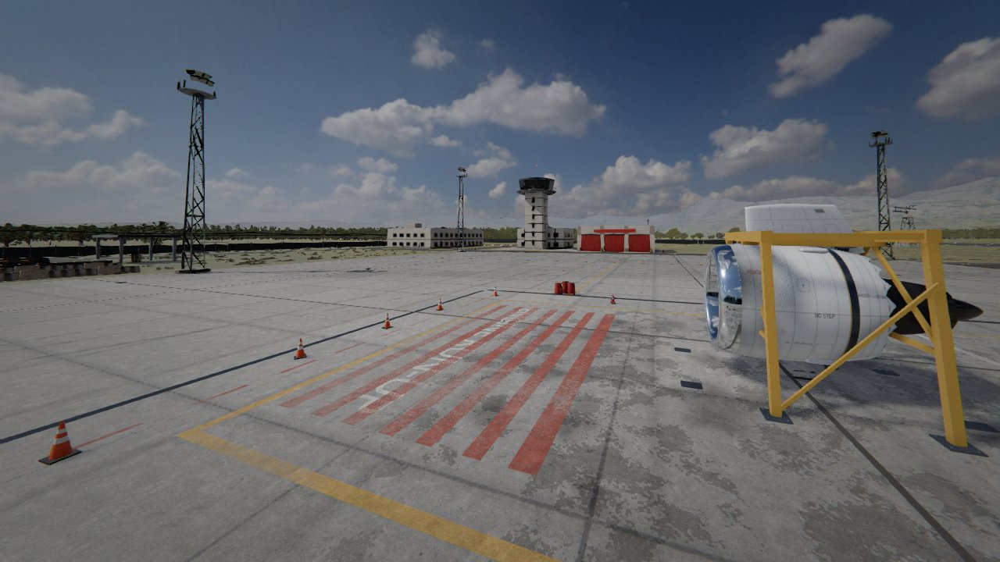 |
| 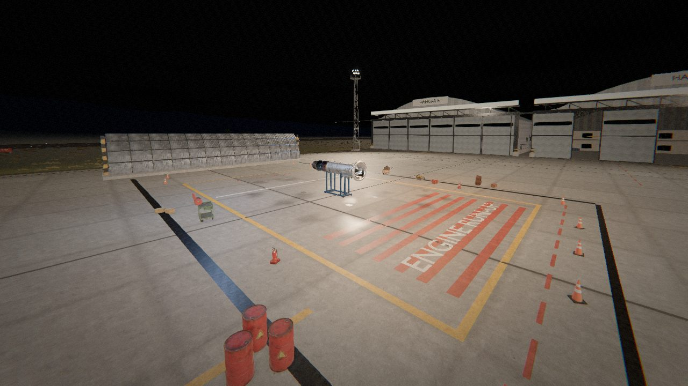 | 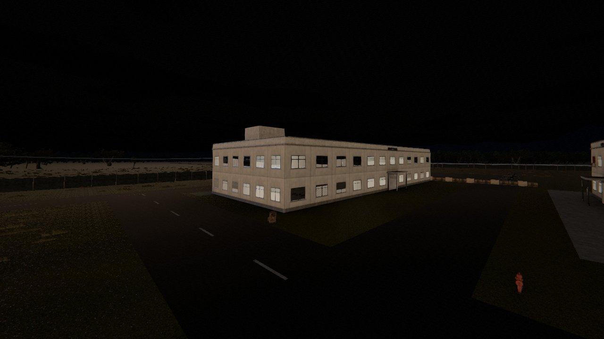 |
| 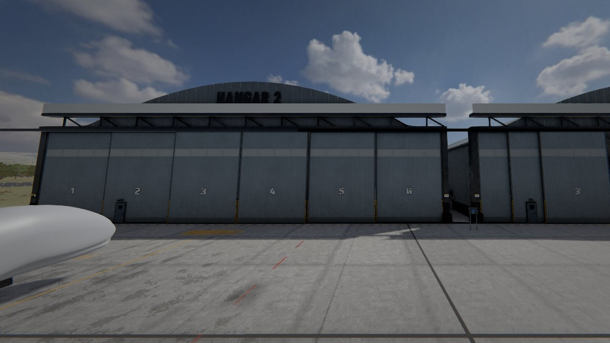 | |
| 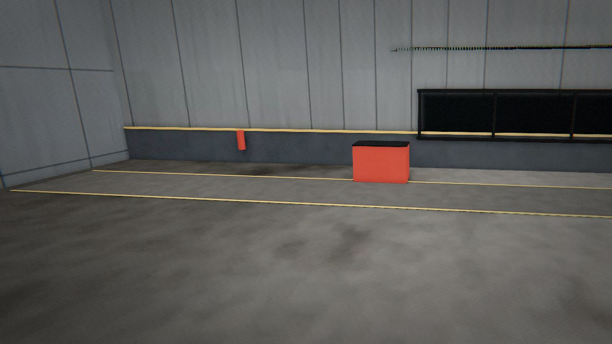 | 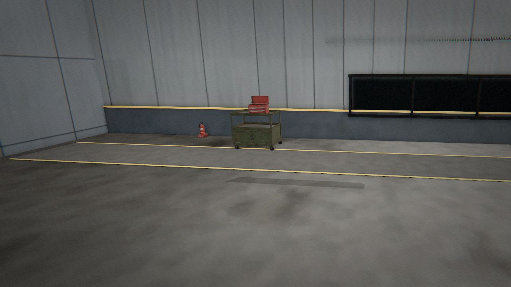 |

**Test hücresi ortamı** — Blender'da modellenip Cycles ile ışığı pişirilmiş
kapalı motor test hücresi: ses yutucu panelli duvarlar, hava girişi susturucusu,
arkada egzoz augmenter'ı, itki ölçüm çerçevesi ve yük hücresi, kontrol odası
camı, bakım platformu, zemin işaretleri. Motorun yansımaları da bu hücreden
alınır. Hücrede Poly Haven'dan gerçek modeller durur: tavan vinci, alet
arabası ve sandığı, kaynak arabası, raf, el arabası, yağ varilleri, yangın
tüpleri, elektrik panoları. Ayarlardan fotoğraf tabanlı ortamlara ya da
prosedürel gökyüzüyle açık havaya geçilebilir.

**Panel detayı** — fan kaportası, çekirdek kaportası ve pilon: perçin ve vida
sıraları, kamlok bağlantılar, yağ servis ve basınç tahliye kapakları, alt kilit
yuvaları, havalandırma panjurları, boroskop tapaları. Blender'da yüksek
poligonlu olarak modellenip normal + AO haritalarına pişirilir.

**Dört motor tipi** — test hücresinde motor seçilebilir; hepsi aynı
termodinamik modelle, kendi tasarım noktasından boyutlandırılır:

| Motor | Sınıf | Öne çıkan |
| --- | --- | --- |
| TF-330 yolcu turbofanı | ~320 kN, BPR 9 | Dev fan, ayrık akış, dersler bu motorla |
| AF-125 askeri turbofan | 81 kN kuru / 129 kN art yakıcılı | Karışık akış, art yakıcı, açılıp kapanan yakınsak-ıraksak lüle |
| TJ-60 turbojet | 45 / 64 kN | Soğuk savaş dönemi, baypassız, iki milli, is bırakan egzoz |
| TP-25 turboprop | 2,85 MW mil gücü | Serbest güç türbini, dişli kutusu, sabit devirli pervane valisi |

Gaz kolu art yakıcılı motorlarda MIL kademesinin ötesine uzanır (IDLE → MIL →
MAX, **B** tuşu); EICAS motor tipine göre değişir (FTIT, TRQ/ITT/NG, NP, lüle
açıklığı, art yakıcı kademesi).

**Kaportasız motorların dış donanımı** — askeri turbofan, turbojet ve
turboprobun gövdesi çıplaktır; üzerinde gerçek motorlardaki gibi değişken
stator (VSV) halkaları ve aktüatörleri, yakıt manifoldu ve enjektör besleme
boruları, ateşleyiciler, boroskop tapaları, aksesuar dişli kutusu, yağ tankı,
FADEC kutusu, gövdeye kelepçelerle oturan yakıt/yağ/bleed boruları ve örgülü
kablo demetleri bulunur. Turboprobun redüktörü gerçekten döner bir planet
dişli setidir (güneş dişlisi türbin milinde, taşıyıcı pervane milinde).

**Motor iç yapısı (M2)** — kanatlar, diskler ve gövdeler istasyon
tablosundan koddan üretilir; dört motor aynı kademe üretecini kullanır.
Kanat kesiti metal açılarından kurulur (yuvarlak hücum, sonlu firar kenarı,
köke dolgu yarıçapı); kompresörde kırlangıç kuyruğu kök, türbinde çam ağacı
kök ve angel wing, HPT'de squealer uç cebi, LPT'de bıçak contalı uç örtüsü.
Her rotor diskinin jantı, gövdesi ve göbeği gerçek kesit profilindedir;
diskleri labirent conta dişli ara kollar bağlar, statorların iç bantları bal
peteği yatağa oturur, değişken statorların mili, kolu ve birleştirme halkası
gövdenin dışındadır. Yüzeyler prosedüreldir: HPT kanatlarında termal bariyer
kaplama, hücum kenarında duş başlığı ve basınç yüzünde film soğutma delikleri,
firar kenarı yarıkları, uçta kızıl-mor ısı tonu; LPT'de kademe ısısına göre
ince oksit renkleri; kompresörde hücum kenarı erozyonu ve arka kademelerde
saman sarısı ısı rengi; disklerde torna izleri. Yanma odasında basamaklı
soğutma halkalı gömlekler (seyreltme delikleri gerçek açıklık), swirler
kapları, enjektörler ve bujiler; askeri lülede pul gibi bindiren yapraklar,
contalar, senkron halka ve lüle alanıyla hareket eden hidrolik aktüatörler
vardır. Kesit görünümünde kesilen katılar müzelerdeki kesit motorları gibi
kırmızı boyalıdır (disk ve millerde dolu kesit, ince duvarlarda ince şerit),
kanat dizileri bütün kalır.

| | |
| --- | --- |
| 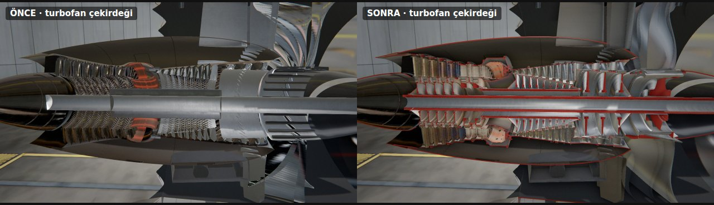 | 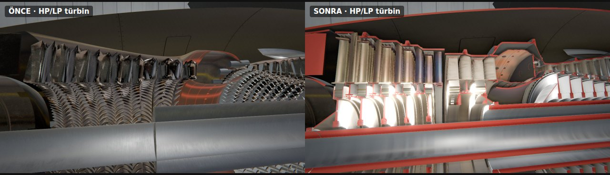 |
| 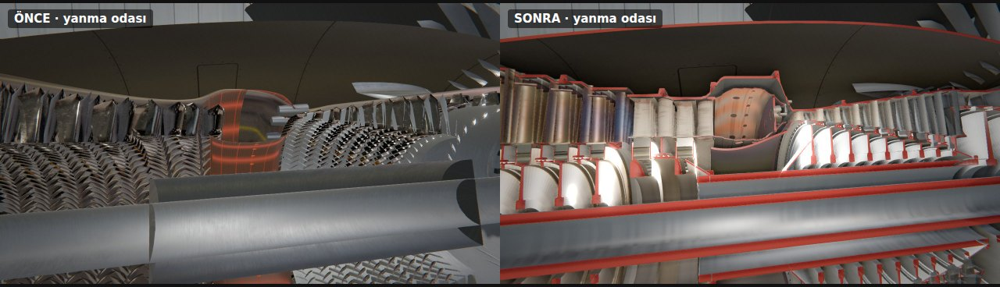 | 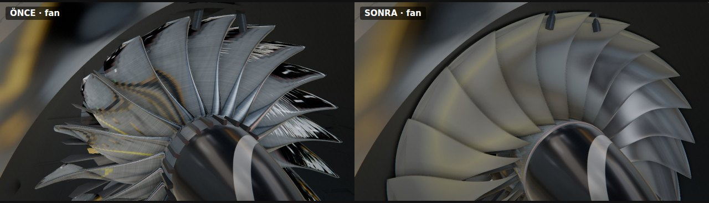 |
| 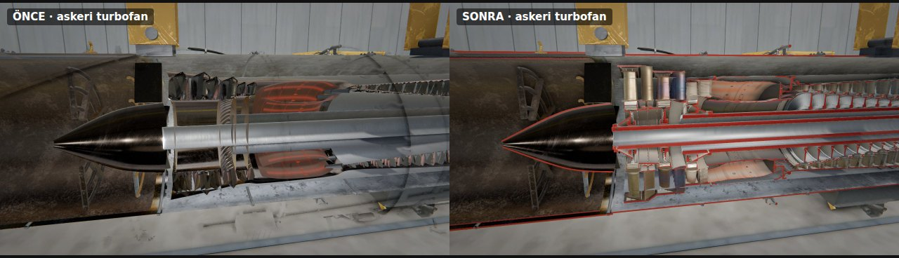 | 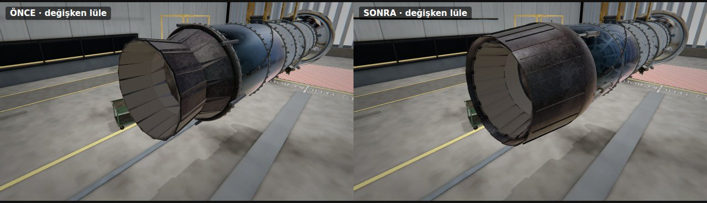 |
| 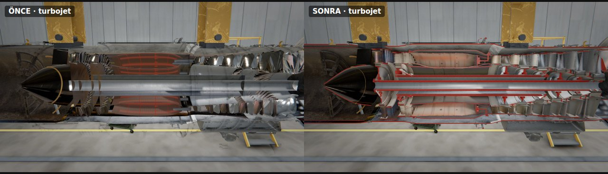 | 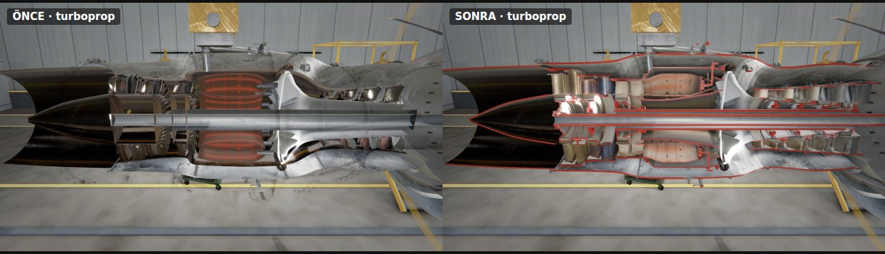 |

**Kit-bash donanım kütüphanesi** — dış donanımın küçük parçaları Blender'da
kodla modellenir: yastıklı boru kelepçeleri, B-somunlu rakorlar, VSV
kolları ve yuvaları, hidrolik aktüatörler, ateşleyici ve uyarıcı kutusu,
yakıt enjektörü flanşları, pompalar, jeneratör, marş motoru, yağ tankı ve
filtresi, FADEC kutusu, sondalar, kaldırma kulakları, flanş cıvataları
(31 parça, her biri 3 detay seviyesi; kalite ayarı seçer). Kaynak dikişi,
tırtıl, perçin ve etiketler (FUEL, OIL, HYDRAULIC, DANGER HIGH VOLTAGE…)
ortak bir trim sheet'ten gelir; gövde yüzeyleri gerçek malzeme taramalarıdır. Oyun parçaları InstancedMesh ile
çizer (yüzlerce parça, birkaç düzine çizim çağrısı).

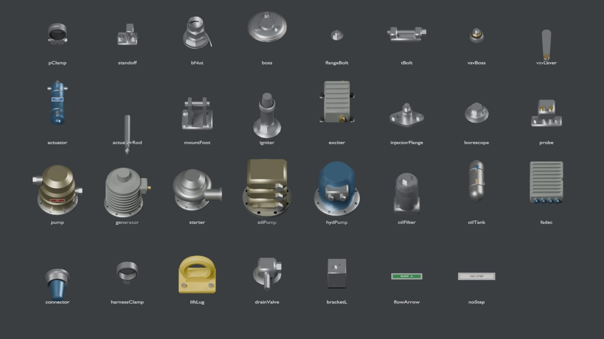

| Önce | Sonra |
| --- | --- |
| 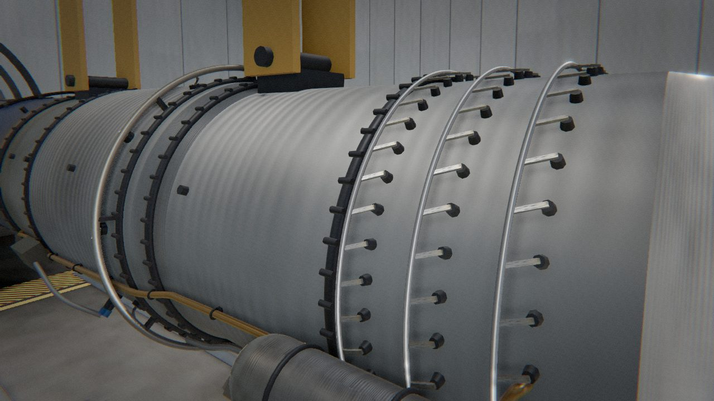 | 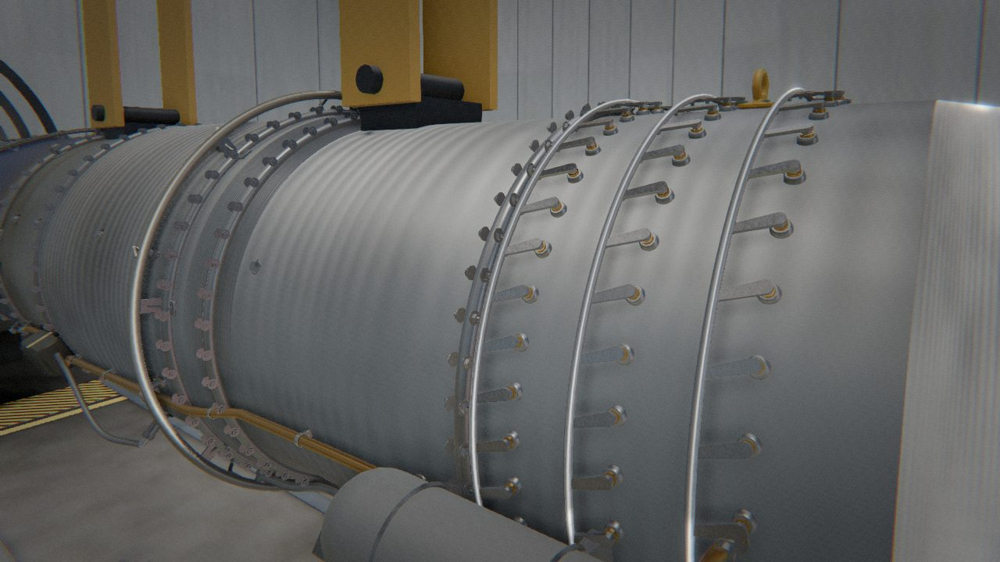 |
| 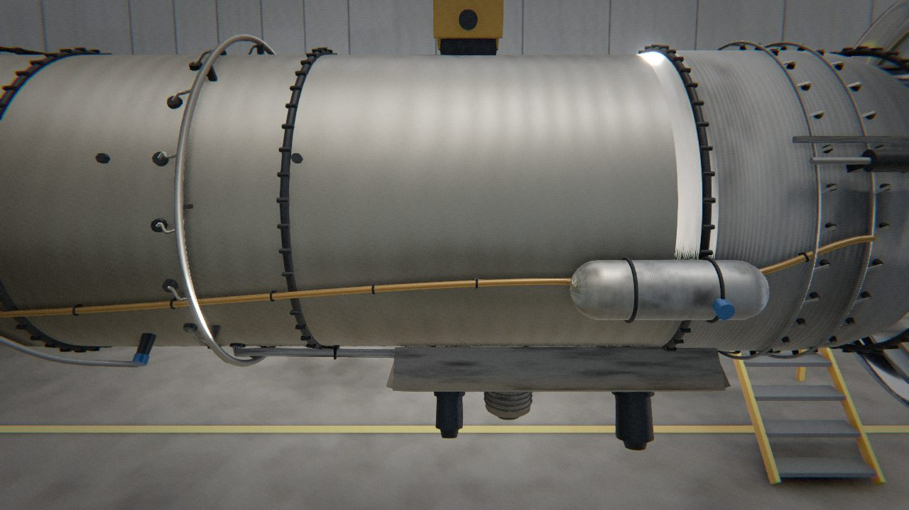 | 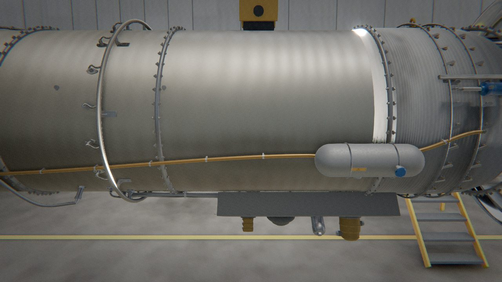 |

**Efektler** — art yakıcıda ışın yürütmeli (raymarch) hacimsel alev ve jet Mach
sayısından hesaplanan şok elmasları; ıslak çalıştırmada yakıt buharı,
light-off'ta is ve kıvılcım, torching ve surge ateş topları, kapatmada buhar;
eski turbojetin dumanı; yerden girişe kıvrılan yoğuşma girdabı, giriş dudağında
yoğuşma, zeminden kalkan toz, pervane uç girdaplarının sarmal izi, sıcak
egzozun ısı kırılması ve zemine vuran art yakıcı ışığı. Art yakıcı rengi
motora göre değişir: temiz yanan modern motorda CH/C₂ ışımasından mavi-mor
çekirdek ve pembe-turuncu uç, is bırakan eski turbojette kurum ışımasından
turuncu-sarı alev. Tam güçte lüle ve art yakıcı gömleği kızarır; duman, alevin
ışığını alır. **Hücre ışıkları** (açık / loş / gece) kapatılınca motoru yalnız
kendi alevi ve kor parçaları aydınlatır.

| | |
| --- | --- |
|  |  |
|  |  |

**Efektler II (M3)** — art yakıcı beş bölgede sırayla tutuşur (içten dışa
halkalar, her bölgede küçük bir "whoomp"), lüle yaprakları bölgelerle aynı
anda açılır; şok elmaslarının Mach diskleri titrer. Egzozun ısı kırılması
artık lüleden genişleyerek uzayan bir hacimdir. Uzun çalışmada egzozun
arkasındaki zemin isle kararır (turbojet en çok, turboprop en az). Kesit
görünümünde çalıştırma sırasında yanma odasının içi görünür: bujilerin
kıvılcımı, enjektörlerden yakıt sisi, light-off'ta alev dilleri. Kapatmadan
sonra türbin kanatları, lüle ve art yakıcı gömleği metal sıcaklığına göre
(siyah cisim rengi) yavaşça soğur. Surge'de girişten ileri alev ve duman
püskürür, nemli havada basınç dalgası halkası görünür, kamera sarsılır.
**Bağıl nem** kaydırıcısı yoğuşma girdabını, giriş dudağındaki ve pervane
uçlarındaki yoğuşmayı ayarlar; soğuk havada egzozdan buhar çıkar. Yeni
**yağmurlu havaalanı** ortamında yağmur yağar, zemin ıslanır, su birikintileri
dalgalanır ve sıcak egzoz borusundan buhar yükselir.


**Serbest mod** — test hücresinde bütün anahtarlar, FADEC'i manuele alma, irtifa /
Mach / sıcaklık, simülasyon hızı (¼×–4×), arıza enjeksiyonu (kuş çarpması,
kompresör/türbin aşınması, marş ve ateşleyici arızası).

**Kokpit** — Boeing tarzı EICAS (N1/EGT/N2 kadranları, FADEC'in magenta hedef
imleci, CAS uyarı mesajları), overhead tarzı çalıştırma paneli, kademeli gaz kolu.

**Motorun içi paneli** — sıcaklığa göre renklenen istasyon şeması (üzerine
gelince 3B'de parça yanar), canlı T–s diyagramı, istasyon tablosu, OPR, BPR,
TSFC, surge payı. Baypassız motorlarda 13/19 istasyonları gizlenir;
turboprobda mil gücü, pervane devri ve itki paylaşımı, art yakıcılı motorlarda
T7 ve lüle açıklığı gösterilir.

**3B etkileşim** — parçanın üzerine gelince motor tipine uygun bilgi kartı
çıkar (ör. turbojetin "fan"ı aslında alçak basınç kompresörüdür); tıklamak
parçayı vurgular, **çift tıklamak kamerayı o noktaya yaklaştırır**. Kesit
görünümü kameraya göre döner: motorun etrafında dolaşırken iç kısım her
açıdan görünür. Kamera açıları motor tipine göre yeniden kadrajlanır.

**Ses** — tamamen sentezlenmiş: fan kanat geçiş tonu, süpersonik fan ucunun
"buzz-saw" sesi, çekirdek ıslığı, jet gürlemesi, marş türbini, ateşleyici
tıkırtısı, surge patlaması. Kamera öndeyse fan, arkadaysa jet baskın duyulur.


## Fizik modeli

`src/sim/` görselden tamamen bağımsız, saf TypeScript bir sıfır boyutlu,
iki milli turbofan modelidir:

- **ISA atmosfer** ve ram etkisi; SAE istasyon numaralandırması
  (0, 2, 13, 19, 21, 25, 3, 4, 45, 5, 9)
- **Tasarım noktası** çevrim analizi donanımı boyutlandırır: lüle alanları, HP
  türbin akış kapasitesi, türbin basınç oranları
- **Tasarım dışı** hesap iki eşleşme problemi çözer: HP kompresörün hız hattı
  üzerindeki konumu HP türbin statorunun akış kapasitesine, LP türbin çıkış
  basıncı çekirdek lülesinin akışına göre bulunur. Yakıt ani artınca T4
  yükselir, çalışma noktası fiziksel olarak surge hattına kayar.
- **Mil dinamiği**: türbin–kompresör tork farkı, hava türbinli marş motoru,
  aksesuar yükü, sürtünme
- **FADEC**: N1 izleme, N2 rölanti, N2 azami ve EGT sınırı döngüleri (hız
  biçimli PI, min/max seçimli), surge korumalı ivmelenme ve sönme korumalı
  yavaşlama sınırları, surge'de otomatik yeniden ateşleme
- **Olaylar**: light-off, marş ayrılması, sıcak/takılı/ıslak çalıştırma,
  torching, surge, flameout, aşırı devir, EGT kırmızı çizgi, kalıcı türbin
  hasarı, kuş çarpması

Doğrulanan değerler (jenerik 2.77 m fanlı, GEnx sınıfı bir motor):

| Büyüklük | Model | Bu sınıf için tipik |
| --- | --- | --- |
| Kalkış itkisi (SLS, ISA) | 319 kN | 280–340 kN |
| TSFC (kalkış) | 8.5 g/(kN·s) | 8–9 |
| Toplam basınç oranı | 46 | 40–50 |
| Rölanti | N1 %22, N2 %62, ~7 kN | N1 ~%20, N2 ~%60–65 |
| Çalıştırma süresi / EGT tepe | ~40 s / ~630 °C | 30–60 s / limit 725–750 °C |
| Rölantiden %95 itkiye | ~5 s | ≤ 5 s (FAR/CS 33.73) |
| 10.7 km, M0.8 azami itki | SLS'nin %16'sı | %15–20 |

## Geliştirme

```bash
npm install
npm run dev          # http://localhost:5173
npm test             # simülasyon birim testleri (vitest)
npm run typecheck    # TypeScript denetimi
npm run build:single # → turbofan.html (tek dosya)
```

Otomatik oynanış testi bütün dersleri gerçek arayüz etkileşimleriyle
(anahtarlara tıklama, klavyeyle gaz kolu, quiz, 3B parça seçme) oynar:

```bash
npm run build && npx vite preview --port 4173 &
node scripts/playtest.mjs ekran-goruntuleri/
```

### Blender varlık hattı

Blender varlıkları elle düzenlenmiş `.blend` dosyası olmadan, tamamen kodla
üretilir; her değişiklik incelenebilir ve yeniden üretilebilir. Blender 4.5,
Python paketi olarak kurulabilir (`pip install bpy==4.5.*`, Python 3.11):

```bash
# Test hücresi: modelleme + Cycles ışık pişirme → glb (4 çekirdekte ~1 saat)
python blender/testcell.py --bake --out src/assets/testcell.glb
python blender/testcell.py --bake --size 1024 --samples 48 --out /tmp/taslak.glb  # hızlı taslak

# Panel detayları (fan kaportası, çekirdek kaportası, pilon): yüksek poligon → normal + ORM
python blender/panel_details.py --out src/assets
python blender/panel_details.py --part core --scale 0.5 --out /tmp   # hızlı taslak
```

Panel yerleşimleri (derzler, kapaklar, kilitler, tapalar) `src/materials/panelLayouts.json`
dosyasındadır; Blender modeli ve oyundaki albedo derzleri aynı dosyadan beslenir.

Kit-bash parçaları ve dokuları (bpy 5.0.1 ile üretildi; `blender/kitlib.py`
ortak geometri yardımcılarını ve trim sheet düzenini içerir):

```bash
python blender/kit_parts.py --out build/kit_raw.glb     # 31 parça × 3 LOD
node scripts/pack-kit.mjs build/kit_raw.glb src/assets/kit.glb   # nicemleme + meshopt
python blender/trim_sheet.py --out src/assets           # kaynak/tırtıl/perçin/etiket (~4 dk)
python blender/kit_preview.py --out build/kit.png       # parça tablosu (görsel kontrol)
```

Dış varlıklar (CC0: Poly Haven HDRI ve modeller, ambientCG taramaları)
tek komutla indirilip dönüştürülür:

```bash
npm run assets:fetch            # hepsi (ya da: -- hdri | scans | models)
```

Varlıkların kaynak ve lisans kaydı: **[ASSETS.md](ASSETS.md)**.

### Dosya düzeni

```
src/
  sim/        termodinamik model, FADEC, olaylar (+ testler)
  engine/     prosedürel 3B motor; visual.ts simülasyonu görselleştirir
  app/        uygulama çekirdeği, kamera, 3B parça seçici
  ui/         EICAS, kokpit, motor içi paneli, ders paneli, menüler
  game/       ders motoru, ders içerikleri, parça bilgileri, bilgi bankası
  audio/      prosedürel motor sesi (Web Audio)
  effects/    art yakıcı alevi, parçacık sistemi, motor efektleri
  core/       gökyüzü/ışık ortamı, görüntü işleme zinciri
  materials/  prosedürel dokular, PBR malzemeler, kaporta yerleşimi
  assets/     Blender çıktıları (test hücresi, kit parçaları, trim sheet, dokular)
blender/      Blender betikleri (test hücresi, panel detayları, kit, trim, malzemeler)
scripts/      tek dosya paketleyici, kit paketleyici, otomatik oynanış testi
```

İleriye dönük plan (motor tasarım atölyesi, uçak tasarımı, Blender varlık
hattı) için bkz. **[ROADMAP.md](ROADMAP.md)**.

## Daha fazla okuma

- FAA, *Aviation Maintenance Technician Handbook — Powerplant* (FAA-H-8083-32),
  kamu malı
- NASA Glenn Research Center, *Beginner's Guide to Propulsion*
- H. Saravanamuttoo ve ark., *Gas Turbine Theory*
- P. Walsh, P. Fletcher, *Gas Turbine Performance*
- J. Mattingly, *Elements of Propulsion: Gas Turbines and Rockets*

## Not

Motor jeneriktir; hiçbir üreticinin markası, logosu ya da tescilli tasarımı
kullanılmamıştır. Prosedürler eğitim amaçlı basitleştirilmiştir ve gerçek uçak
kontrol listelerinin yerini tutmaz.
